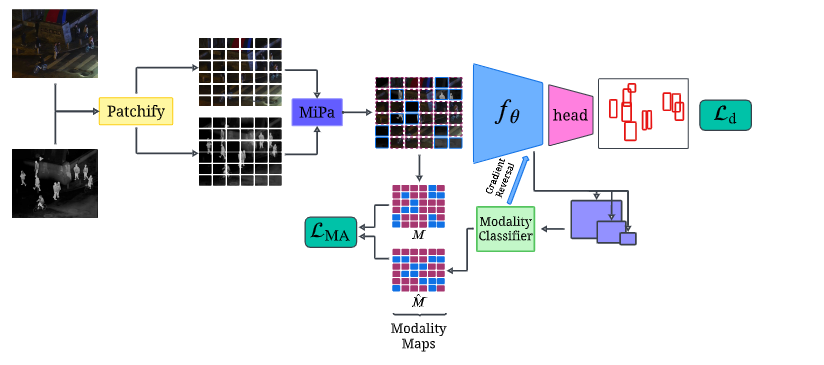
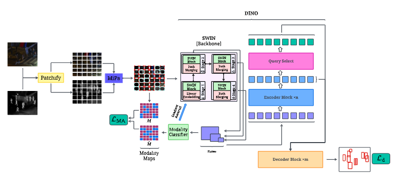
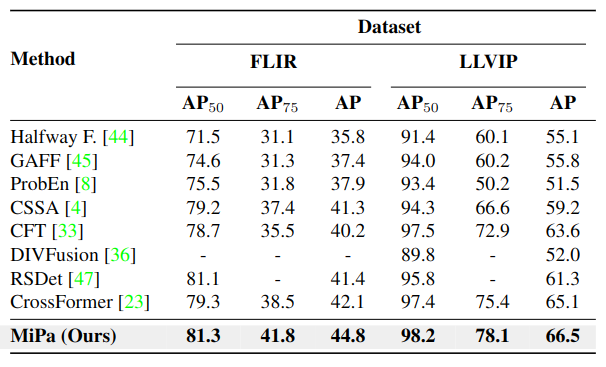

# MiPa

This is the repository for our paper [WACV2025] MiPa: Mixed Patch Infrared-Visible Modality Agnostic Object Detection 🔗 by Heitor Rapela Medeiros, David Latortue, Eric Granger, Marco Pedersoli. 

## News

 - Paper is accepted at WACV2025 (Early accepted in the first round: ~12.1% acceptance rate).
 - We released a initial version of the code, more details are coming ...
 - Arxiv: https://arxiv.org/pdf/2404.18849 
 - If you find any problem or have any questions, please feel free to contact us!

## MiPa with DINO

## Benchmarking

## References

- Thanks to the great open-source community that provided good libraries.
- Code build on the top of DINO and Deformable-DETR